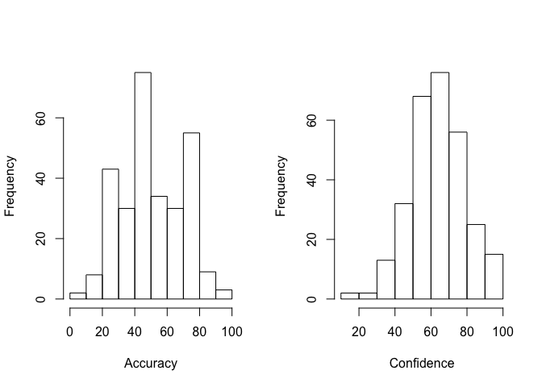
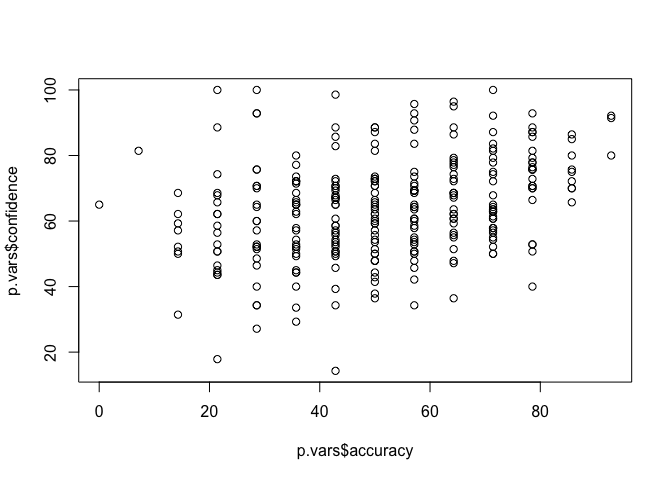
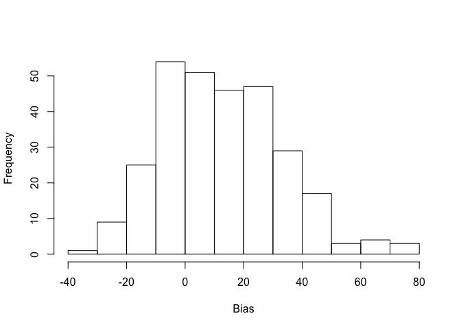
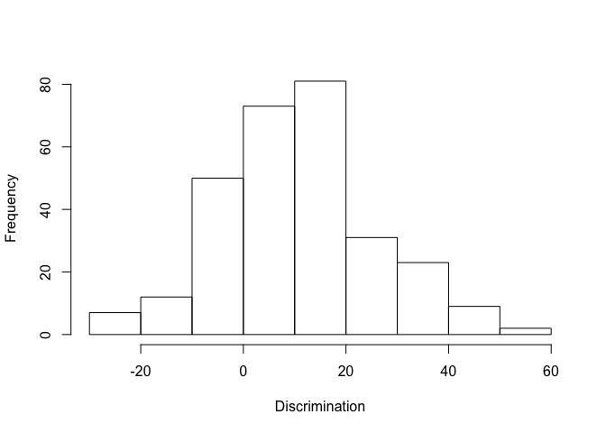
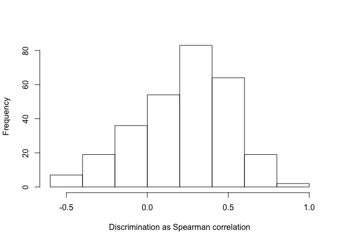
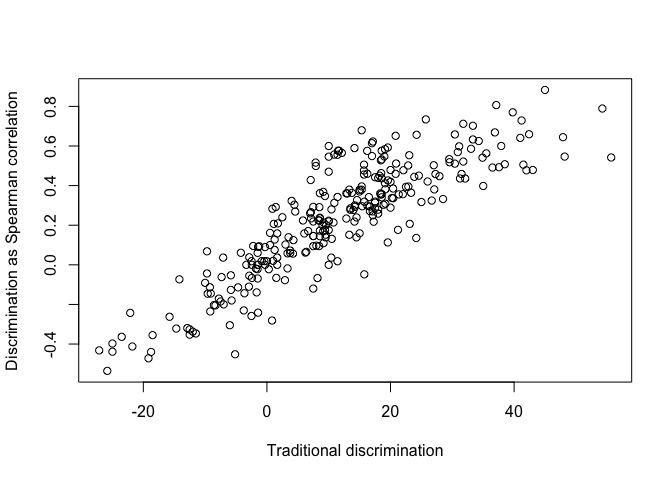
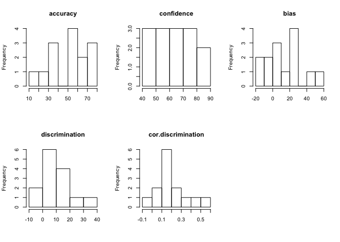

# Calculating confidence variables in R
Simon A Jackson  
1 March 2016  

Asking for confidence ratings is a common and important practice in psychological research. However, I often meet researchers who have gathered these ratings but shy away from computing useful information because they're unsure what to do. If this sounds like you, read on! My goal is to demonstrate how I go about calculating some of the most common and useful confidence variables in R, and provide general advise for calculating any variables. Of course anyone can follow along, but this post generally assumes that you have a working knowledge of R.

# What are confidence ratings?

Quick check - what are confidence ratings? Confidence ratings are a particular type of metacognitive rating. They are used to determine the level of certainty a person feels in relation to a particular judgement or decision. A typical example might look like:

- What is the longest river in Asia?
- How confident are you that your answer is correct from 0% (not at all confident) to 100% (completely confident)?

Psychology experiments often collect these sorts of ratings from many people, in response to many questions. The benefits of collecting these ratings are vast... too vast to cover here. Suffice it to say that the collection of confidence ratings has helped researchers to make many important contributions to their respective fields in the psychological world.

So, returning to our focus, many researchers see the value in collecting these ratings, but have little to no idea about how to use them. Let's have a look at some typical variable calculations and analyses using confidence ratings.

# The data

We'll be making use of the data I collected during my Ph.D, which is available in the `jacksonphd` package from my Github (<https://github.com/drsimonj>). At the time I'm writing this post, this package is still in development, but the data is available, so we'll use it with some added explanation. If you'd like to use the data for your own purposes, please email me at <drsimonjackson@gmail.com>.

Begin by installing the `jacksonphd` package from Github. This will require the `devtools` package.


```r
install.packages("devtools")
library(devtools)
devtools::install_github("drsimonj/jacksonphd")
```

```r
library(jacksonphd)
```

```
## Thanks for downloading my PhD data. Enjoy!
```

If all goes well, you should now have access to the data collected for my Ph.D in a list called `phd`. Let's take a quick look at the contents of this list.


```r
lapply(phd, names)
```

```
## [[1]]
## [1] "MD"   "PM"   "EA"   "GK"   "demo"
## 
## [[2]]
## [1] "MD"   "PM"   "SR"   "LC"   "EA"   "VT"   "GK"   "demo"
## 
## [[3]]
## [1] "MD"   "PM"   "SR"   "LC"   "EA"   "VT"   "GK"   "demo"
## 
## [[4]]
## [1] "MD"   "PM"   "EA"   "NS"   "demo"
```

We can see that `phd` contains four lists. Each of these corresponds to one of four participant samples I collected. Each of these lists contains multiple data frames with names like `MD`, `PM`, etc. Each of these is data for a specific test. For example, `MD` stands for the Medical Decision-making test, `EA` is the Esoteric Analogies test, and so on.

For this post, we'll just use data from one test: The Esoteric Analogies test. This test asks questions like **LOVE is to HATE as FRIEND is to: LOVER, PAL, OBEY, ENEMY?** Each question is followed by a confidence rating similar to the earlier example (but using radio buttons with 10% increments: 0%, 10%, 20%, etc). Let's get data for this test from sample 2.


```r
dat <- phd[[2]]$EA  # Data from Esoteric Analogies test for sample 2.
head(dat)
```

```
##    a1 a2 a3 a4 a5 a6 a7 a8 a9 a10 a11 a12 a13 a14  c1 c2 c3  c4 c5  c6 c7
## 33  0  1  0  1  0  1  0  1  1   0   0   0   1   1  80 50 80 100 80 100 90
## 34  1  1  0  1  1  1  1  1  0   1   1   1   0   1  60 70 30  60 60  70 60
## 35  1  1  0  0  1  0  0  1  1   0   1   0   1   0  90 90 90  70 30  80 90
## 36  1  1  1  1  1  0  1  1  1   0   1   0   1   1  90 90 90  90 40  80 80
## 37  0  1  1  1  1  1  1  0  0   1   0   1   1   1 100 50 70  90 20  90 70
## 38  1  1  1  1  0  1  0  1  0   0   0   0   1   1  80 10 70  90 20  70 70
##     c8  c9 c10 c11 c12 c13 c14 d1 d2 d3 d4 d5 d6 d7 d8 d9 d10 d11 d12 d13
## 33 100 100  60 100  80 100 100  1  0  1  1  1  1  1  1  1   1   1   1   1
## 34  70  40  80  10  60  10  60  1  1  0  1  1  1  1  1  1   1   0   1   0
## 35 100  90  50  20  20   0  30  1  1  1  1  1  1  1  1  1   1   0   1   0
## 36  80  90  70  30  40  30  80  1  1  1  1  0  1  1  1  1   1   0   0   0
## 37 100  30  60  80  40  60  40  1  0  1  1  1  1  1  1  0   1   0   1   1
## 38  90  10  50  20   0  70  50  1  0  1  1  0  1  1  1  0   1   1   0   1
##    d14     t1     t2     t3     t4     t5     t6     t7     t8     t9
## 33   1 17.000 31.329 20.903 29.645 15.012 17.212 23.210 21.246 17.478
## 34   1 22.502 21.815 28.457 19.939 22.992 12.210 16.159 17.097 22.315
## 35   1 23.888 12.547  8.788 14.276 11.714  9.742  6.355  7.963  7.079
## 36   1 21.284 19.127 14.246  9.746 49.060 22.155 24.800 13.180 11.651
## 37   0 27.946 64.975 38.193 20.388 61.340 18.357 24.323  8.962 41.735
## 38   1  9.581 12.657 10.588 10.042 13.483  8.963 11.253 13.089 15.754
##       t10    t11    t12    t13    t14   id
## 33  4.659 29.613 35.325 56.952 26.456 2026
## 34 15.009 25.927 15.493 22.372 13.075 2003
## 35 11.180 12.658  9.484 13.138  6.721 2004
## 36 36.459 20.189 30.376 15.713 17.140 2005
## 37 22.148 14.459 13.058 12.779 40.153 2007
## 38 15.785  9.033 12.259 14.445 15.135 2011
```

We can see that the data is in a wide format (i.e., one row per participant). We have columns `a1-14`, `c1-14`, `d1-14`, `t1-14`, and a unique participant `id`. Except for `id`, each column corresponds to some information about one of 14 test items/questions. For each item, we're concerned with information about participants' answer accuracy (`a1-14`) and confidence (`c1-14`). For answer accuracy, `1` indicates a correct answer and `0` an incorrect answer. The confidence ratings report the percentage confidence (0-100) rated by the participant. These are the column naming conventions that I tend to use, but you can use whatever suits you best. My only advice would just be to remain simple and consistent.

Next we want to get this from wide to long format. We can work in wide format, but it means that we have to handle variable calculations for participants and items in different ways. In wide format, for example, to calculate variables for each participant, we'd likley use something like `apply(data.frame, 1, functionToComputeVariable)` to iterate through rows. But for each question, we'd probably need to use something like `mapply(functionToComputeVariable, accuracy.data, confidence.data)` to simultaneously work through the answer accuracy and confidence for each question. In long format, we can ignore these differences. I've provided a convenience function in the `jacksonphd` package to do this for us using my data. If you're using other data, there are many good tutorials on how to achieve this. [HERE'S](http://www.r-bloggers.com/converting-a-dataset-from-wide-to-long/) a nice example using the `reshape` package.


```r
long <- stretchPhd(dat)  # convert to long format - from jacksonphd package
head(long)
```

```
##     id item i.correct i.confidence i.decision   i.rt
## 1 2026    1         0           80          1 17.000
## 2 2026    2         1           50          0 31.329
## 3 2026    3         0           80          1 20.903
## 4 2026    4         1          100          1 29.645
## 5 2026    5         0           80          1 15.012
## 6 2026    6         1          100          1 17.212
```

We now have our data in a long format. We have columns for the participant id and test item number. Then separate columns for what were `a1-14`, `c1-14`, `d1-14`, and `t1-14`. Respectively, these are number `i.correct`, `i.confidence`, `i.decision` and `i.rt`. Again, we're just interested in whether an answer was correct, and how confident the person was in their answer. So we'll be looking at `i.correct` and `i.confidence`.

# Variables for each Participant

## Accuracy and Confidence 

Often, the first couple of variables that we're interested in are participants' test scores, called *accuracy* (expressed as a percentage), and the mean of their confidence ratings, called *confidence*. Note that *accuracy* isn't a confidence-based variable, but we'll need it in a moment. We do, however, want to put *accuracy* on the same scale as confidence (again, we'll see why in a second). So let's calculate both as a percent. When working with a vector of 1s and 0s, a neat trick is that the vector mean is the proportion of 1s. So if we calculate the mean of `i.correct` for a participant, we'll have the proportion of answers they got correct. We then just need to multiply this by 100 to convert to a percentage. Confidence is already in a percent format, so we just need to calculate the mean.

We'll do this using `by()` to calculate the results separately for each participant.


```r
# Calculate participant (p) accuracy
p.accuracy <- by(long, long$id, function(p) mean(p$i.correct) * 100)

# Put results into a Participant Variables data frame
p.vars <- data.frame(id = names(p.accuracy),
                     accuracy = as.vector(p.accuracy))

head(p.vars)
```

```
##     id accuracy
## 1 2001 42.85714
## 2 2002 28.57143
## 3 2003 78.57143
## 4 2004 50.00000
## 5 2005 78.57143
## 6 2006 71.42857
```

We can do the same for confidence but without multiplying by 100.


```r
# Calculate participant confidence
p.confidence <- by(long, long$id, function(p) mean(p$i.confidence))

# Add results to the Participant Variables data frame
p.vars <- cbind(p.vars, confidence = as.vector(p.confidence))
```

Let's take a look at our variables so far.


```r
head(p.vars)
```

```
##     id accuracy confidence
## 1 2001 42.85714   66.42857
## 2 2002 28.57143   27.14286
## 3 2003 78.57143   52.85714
## 4 2004 50.00000   60.71429
## 5 2005 78.57143   70.00000
## 6 2006 71.42857   54.28571
```

```r
summary(p.vars)
```

```
##        id         accuracy       confidence    
##  2001   :  1   Min.   : 0.00   Min.   : 14.29  
##  2002   :  1   1st Qu.:35.71   1st Qu.: 52.86  
##  2003   :  1   Median :50.00   Median : 64.29  
##  2004   :  1   Mean   :51.21   Mean   : 63.96  
##  2005   :  1   3rd Qu.:64.29   3rd Qu.: 72.86  
##  2006   :  1   Max.   :92.86   Max.   :100.00  
##  (Other):283
```

```r
par(mfrow = c(1, 2))  # Plot histograms
hist(p.vars$accuracy, xlab = "Accuracy", main = "")
hist(p.vars$confidence, xlab = "Confidence", main = "")
```



```r
par(mfrow = c(1, 1))  # reset plotting area
plot(p.vars$accuracy, p.vars$confidence)
```



Looks good. We now have *accuracy* and *confidence* variables for each participant, with means of 51.21% and 63.96%, respectively. None of the values fall outside an acceptable range of 0-100, and there is good spread around a somewhat normal-looking distribution. We also have a correlation of 0.32 between participants' accuracy and confidence, which is a little bit lower than normal for this sort of data, but not unusual.

Before moving ahead, let's create functions to handle what we've done so far. This will become useful for when we want to look at question metrics rather than participants.

For accuracy, we want to take the mean of a vector of ones and zeros, and multiply it by 100. For confidence, we just want to take the mean of a numeric vector.


```r
#' Compute accuracy from a vector of 1s (correct) and 0s (incorrect)
#' Remove missing values by default to be safe.
#'
#' @param x Vector of 1s and 0s
#' @return Percent correct
computeAccuracy <- function(x) {
  mean(x, na.rm = TRUE) * 100
}

#' Compute mean confidence from a numeric vector
#' We'll remove missing values by default to be safe.
#'
#' @param x Numeric vector of confidence ratings
#' @return Mean confidence
computeConfidence <- function(x) {
  mean(x, na.rm = TRUE)
}
```

Now let's retry to tighten everything up a bit. Instead of iterating over the whole data set `long`, we'll just iterate over the variable of interest. We'll also use our new functions to cut down on the code. So, starting again...


```r
# Calculate participant (p) accuracy
p.accuracy <- by(long$i.correct, long$id, computeAccuracy)

# Calculate participant confidence
p.confidence <- by(long$i.confidence, long$id, computeConfidence)

# Put results into a Participant Variables data frame
p.vars <- data.frame(id = names(p.accuracy),
                     accuracy = as.vector(p.accuracy),
                     confidence = as.vector(p.confidence))
```

And check that everything looks the same:


```r
summary(p.vars)
```

```
##        id         accuracy       confidence    
##  2001   :  1   Min.   : 0.00   Min.   : 14.29  
##  2002   :  1   1st Qu.:35.71   1st Qu.: 52.86  
##  2003   :  1   Median :50.00   Median : 64.29  
##  2004   :  1   Mean   :51.21   Mean   : 63.96  
##  2005   :  1   3rd Qu.:64.29   3rd Qu.: 72.86  
##  2006   :  1   Max.   :92.86   Max.   :100.00  
##  (Other):283
```

Looks good. Time to move on.

## Bias
From here, the most commonly calculated variable is *bias*, often referred to as *over/underconfidence*. *Bias* is calculated simply as *confidence* minus *accuracy*, and it tells us whether a person tends to be overconfident or underconfident in their answers. This calculation is simple now that we have *accuracy* and *confidence* for each person.

We could take the literal approach of `p.vars$bias <- p.vars$confidence - p.vars$accuracy`. This is probably easiest, but I'll continue using functions for consistency sake.


```r
#' Compute bias scores from vectors of mean confidence and percent correct accuracy scores
#'
#' @param confidence Vector of mean percent confidences
#' @param accuracy Vector of percent answers correct
#' @return Vector of bias (over/underconfidence) scores
computeBias <- function(confidence, accuracy) {
  confidence - accuracy
}

# Compute bias for all participants
p.vars$bias <- computeBias(p.vars$confidence, p.vars$accuracy)

hist(p.vars$bias, xlab = "Bias", main = "")
```



We can see that our participants are mostly overconfident (bias > 0), but there are still a large number of participants who are well calibrated (bias around 0) and some even underconfident (bias < 0).

Let's move on to a more complicated variable.

## Discrimination

Discrimination is a measure of how well a person has distinguished between correct and incorrect answers. There are a number of methods for calculating this. We'll start with the traditional measure of mean confidence for correct answers minus mean confidence for incorrect answers. Let's start with the appropriate function.


```r
#' Compute a traditional discrimination score.
#'
#' @param i.correct Vector of 1s and 0s corresponding to answers being correct or not.
#' @param i.confidence Numeric vector of confidence ratings corresponding to the answers.
#' @return Traditional discrimination score
computeDiscrimination <- function(i.correct, i.confidence) {
  # First check that there is at least one of both correct and incorrect
  # answers. If not, return NA as discrimination cannot be calculated.
  if (length(unique(i.correct)) <= 1)
    return (NA)
  
  # Otherwise...
  
  # Create logical vector indexing correct answers
  correct <- as.logical(i.correct)
  
  # Compute mean confidence for correct answers.
  confidence.correct <- mean(i.confidence[correct])
  
  # And for incorrect
  confidence.incorrect <- mean(i.confidence[!correct])
  
  # Return their difference
  confidence.correct - confidence.incorrect
}
```

Now we'll use this to compute discrimination for each participant.


```r
p.discrimination <- by(long, long$id, function(p) {
  computeDiscrimination(p$i.correct, p$i.confidence)
})

p.vars <- cbind(p.vars, discrimination = as.vector(p.discrimination))
```

and take a quick look...


```r
summary(p.vars)
```

```
##        id         accuracy       confidence          bias        
##  2001   :  1   Min.   : 0.00   Min.   : 14.29   Min.   :-38.571  
##  2002   :  1   1st Qu.:35.71   1st Qu.: 52.86   1st Qu.: -2.143  
##  2003   :  1   Median :50.00   Median : 64.29   Median : 11.429  
##  2004   :  1   Mean   :51.21   Mean   : 63.96   Mean   : 12.753  
##  2005   :  1   3rd Qu.:64.29   3rd Qu.: 72.86   3rd Qu.: 26.429  
##  2006   :  1   Max.   :92.86   Max.   :100.00   Max.   : 78.571  
##  (Other):283                                                     
##  discrimination  
##  Min.   :-27.14  
##  1st Qu.:  0.75  
##  Median : 10.47  
##  Mean   : 11.17  
##  3rd Qu.: 19.17  
##  Max.   : 55.71  
##  NA's   :1
```

```r
hist(p.vars$discrimination, xlab = "Discrimination", main = "")
```



As the mean is greater than zero, we can see that participants are generally able to discirminate their correct from incorrect answers. We can see, however, that a number of participants are unable to do this, with discrimination scores of zero or even less. Negative scores might indicate a problem to us for further investigation (e.g., perhaps these participants were not responding correctly, misread the instructions, or were not trying).

Let's move on to an alternate measure of discrimination: the confidence-accuracy correlation. In this case, we correlate a participant's confidence ratings with their answer accuracy. A more positive correlation indicates to us that the person has better discriminated correct from incorrect answers. This is commonly done using a gamma correlation given the ordinal nature of the data. To save us from importing more packages, I'll demonstrate this using the base correlation function, `cor()` with the method set to `spearman`. Again, we'll create a function to handle this. We'll then use it with `by()` to calculate the variable and `cbind` it to our variable data frame.


```r
#' Compute discrimination as a confidence-accuracy correlation.
#'
#' @param i.correct Vector of 1s and 0s corresponding to answers being correct or not.
#' @param i.confidence Numeric vector of confidence ratings corresponding to the answers.
#' @param method a character string indicating which correlation coefficient (or
#'    covariance) is to be computed. One of "pearson", "kendall", or
#'    "spearman" (default): can be abbreviated. See ?cor for more details.
#' @return Traditional discrimination score
computeCorDiscrimination <- function(i.correct, i.confidence, method = "spearman") {

  # First check that there is at least one of both correct and incorrect
  # answers. If not, return NA as discrimination cannot be calculated.
  if (length(unique(i.correct)) <= 1)
    return (NA)
  
  # Also check that there is variance in confidence, which is needed to compute
  # the correlation.
  if (length(unique(i.confidence)) <= 1)
    return (NA)
  
  # Otherwise, return correlation
  cor(i.correct, i.confidence, method = method)
}

# Compute variable for each participant and bind to other variables in data frame
p.cor.discrimination <- by(long, long$id, function(p) {
  computeCorDiscrimination(p$i.correct, p$i.confidence)
})
p.vars <- cbind(p.vars, cor.discrimination = as.vector(p.cor.discrimination))

# Examine
hist(p.vars$cor.discrimination, xlab = "Discrimination as Spearman correlation", main = "")
```



We now have a second measure of discrimination. From this, our conclusion about discrimination would be similar - participants were generally able to distinguish correct from incorrect answers. However, some participants were unable to do this (correlation around 0), and others had unusual results (correlation < 0) worthy of investigation.

Let's correlate our two discrimination variables to check that they're capturing the same psychological construct.


```r
cor(p.vars$discrimination, p.vars$cor.discrimination, use = "complete.obs")
```

```
## [1] 0.865564
```

```r
plot(p.vars$discrimination, p.vars$cor.discrimination,
     xlab = "Traditional discrimination", ylab = "Discrimination as Spearman correlation")
```



Looks like a good correlation between these variables (0.87), suggesting that we could probably choose either variable as an indicator of discrimination.

# Variables for each Item

Sometimes, we're more interested in the difference between items/questions than participants. We've now set ourselves up to make life really easy when it comes to switching. By having data in long format, we only need to change the index in `by()` from `id` to `item`. Furthermore, because we've created generally applicable functions for all of our variables, we don't need to write long sections of code anymore. Let's get to it:


```r
# For each item, calculate...
i.accuracy <- by(long$i.correct, long$item, computeAccuracy)  # Accuracy

i.confidence <- by(long$i.confidence, long$item, computeConfidence)  # Confidence

i.bias <- computeBias(i.confidence, i.accuracy)  # Bias

i.discrimination <- by(long, long$item, function(i) {  # Traditional discrimination
  computeDiscrimination(i$i.correct, i$i.confidence)
})

i.cor.discrimination <- by(long, long$item, function(i) { # Correlation-based Discrimination
  computeCorDiscrimination(i$i.correct, i$i.confidence)
})

# Put results into an Item Variables data frame
i.vars <- data.frame(item = names(i.accuracy),
                     accuracy = as.vector(i.accuracy),
                     confidence = as.vector(i.confidence),
                     bias = as.vector(i.bias),
                     discrimination = as.vector(i.discrimination),
                     cor.discrimination = as.vector(i.cor.discrimination))
```

Let's take a look.


```r
print(i.vars)
```

```
##    item accuracy confidence       bias discrimination cor.discrimination
## 1     1 35.98616   81.55709  45.570934    -0.32952183        -0.05214049
## 2     2 77.16263   65.25952 -11.903114    19.38306835         0.31780949
## 3     3 70.58824   72.00692   1.418685    11.34313725         0.20463160
## 4     4 79.58478   82.49135   2.906574     9.73249816         0.17631555
## 5     5 31.14187   54.56747  23.425606    -0.01730877         0.01411730
## 6     6 51.55709   74.84429  23.287197     3.71572387         0.09353781
## 7     7 13.49481   64.11765  50.622837     9.46769231         0.14100869
## 8     8 65.39792   78.47751  13.079585     8.06984127         0.16809137
## 9     9 52.94118   48.23529  -4.705882    11.25000000         0.17559055
## 10   10 33.56401   62.97578  29.411765     7.31421821         0.15008344
## 11   11 63.66782   58.30450  -5.363322    26.80538302         0.41431197
## 12   12 24.91349   45.08651  20.173010     8.39349718         0.14780665
## 13   13 58.82353   47.61246 -11.211073    37.36974790         0.51971553
## 14   14 58.13149   59.96540   1.833910    12.30913026         0.24269801
```

```r
summary(i.vars)
```

```
##       item      accuracy       confidence         bias        
##  1      :1   Min.   :13.49   Min.   :45.09   Min.   :-11.903  
##  10     :1   1st Qu.:34.17   1st Qu.:55.50   1st Qu.: -3.175  
##  11     :1   Median :55.54   Median :63.55   Median :  7.993  
##  12     :1   Mean   :51.21   Mean   :63.96   Mean   : 12.753  
##  13     :1   3rd Qu.:64.97   3rd Qu.:74.13   3rd Qu.: 23.391  
##  14     :1   Max.   :79.58   Max.   :82.49   Max.   : 50.623  
##  (Other):8                                                    
##  discrimination    cor.discrimination
##  Min.   :-0.3295   Min.   :-0.05214  
##  1st Qu.: 7.5031   1st Qu.: 0.14271  
##  Median : 9.6001   Median : 0.17184  
##  Mean   :11.7719   Mean   : 0.19383  
##  3rd Qu.:12.0676   3rd Qu.: 0.23318  
##  Max.   :37.3698   Max.   : 0.51972  
## 
```

```r
# Plot histograms for all variables
variables <- names(i.vars)[names(i.vars) != "item"]
par(mfrow = c(2, 3))  # Plot histograms
for(var in variables)
  hist(i.vars[, var], xlab = "", main = var)

par(mfrow = c(1, 1))  # reset plotting area
```



We can now look for items that are very difficult or too easy, tricky items that produce considerable overconfidence or poor discrimination, and so on.

# Summary

This concludes the quick guide for computing some of the most common confidence rating variables for participants and questions using R. There are a plethora of other variables that can be calculated, but, hopefully, this demonstration will provide you with a standard approach for getting the variables you want. To recap the general approach I've used here for calculating any confidence variables:

- Arrange your data in a long format.
- Write a function to compute your variable taking only the inputs that are required (genearlly answer accuracy and confidence).
- Use your function in `by()` to compute your variable for participants, items, or any other grouping variable that interests you.
- Bind your results into a data frame and voila!

# Sign-off 

As always, what's presented here is just my approach. It's not the only approach, and it's unlikley to be the best approach. But my hope is that you're able to glean something useful from it. Please comment, email me at <drsimonjackson@gmail.com>, or tweet me @drsimonj to chat!
